# Emery Agent Orchestration Flow

This document describes the complete orchestration flow for the Emery agent system, including state machines, message flow, and event handling.

## Table of Contents
- [1. Execution Coordinator State Machine](#1-execution-coordinator-state-machine)
- [2. Interrupt Handling State Machine](#2-interrupt-handling-state-machine)
- [3. Complete Message Flow](#3-complete-message-flow)
- [4. @agent Mention Routing](#4-agent-mention-routing)
- [5. Event Types](#5-event-types)
- [6. Callback Patterns](#6-callback-patterns)
- [7. Error Recovery Flow](#7-error-recovery-flow)
- [8. Key Files Reference](#8-key-files-reference)

---

## 1. Execution Coordinator State Machine

The main state machine that controls the orchestration phases.

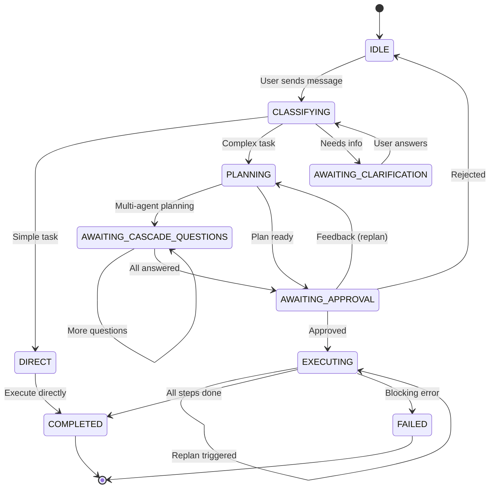
```mermaid
stateDiagram-v2
    [*] --> IDLE

    IDLE --> CLASSIFYING: User sends message

    CLASSIFYING --> DIRECT: Simple task
    CLASSIFYING --> PLANNING: Complex task
    CLASSIFYING --> AWAITING_CLARIFICATION: Needs info

    DIRECT --> COMPLETED: Execute directly

    AWAITING_CLARIFICATION --> CLASSIFYING: User answers

    PLANNING --> AWAITING_CASCADE_QUESTIONS: Multi-agent planning
    PLANNING --> AWAITING_APPROVAL: Plan ready

    AWAITING_CASCADE_QUESTIONS --> AWAITING_CASCADE_QUESTIONS: More questions
    AWAITING_CASCADE_QUESTIONS --> AWAITING_APPROVAL: All answered

    AWAITING_APPROVAL --> IDLE: Rejected
    AWAITING_APPROVAL --> PLANNING: Feedback (replan)
    AWAITING_APPROVAL --> EXECUTING: Approved

    EXECUTING --> EXECUTING: Step completed
    EXECUTING --> EXECUTING: Replan triggered
    EXECUTING --> COMPLETED: All steps done
    EXECUTING --> FAILED: Blocking error

    COMPLETED --> [*]
    FAILED --> [*]
```

### Phase Details

| Phase | Description | Tools Available |
|-------|-------------|-----------------|
| IDLE | Waiting for user input | N/A |
| CLASSIFYING | LLM determines task complexity | N/A |
| PLANNING | Generating execution plan | Read-only |
| AWAITING_APPROVAL | Waiting for user to approve plan | N/A |
| EXECUTING | Running plan steps | All tools |
| COMPLETED | Task finished successfully | N/A |
| FAILED | Task failed with error | N/A |

---

## 2. Interrupt Handling State Machine

How user interrupts during active phases are processed.

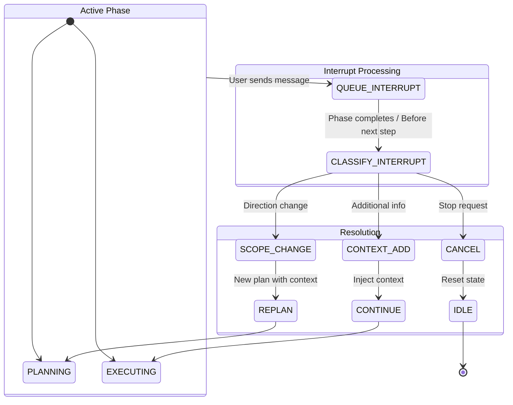
```mermaid
stateDiagram-v2
    state "Active Phase" as active {
        [*] --> PLANNING
        [*] --> EXECUTING
    }

    state "Interrupt Processing" as interrupt {
        QUEUE_INTERRUPT --> CLASSIFY_INTERRUPT: Phase completes / Before next step

        CLASSIFY_INTERRUPT --> CONTEXT_ADD: Additional info
        CLASSIFY_INTERRUPT --> SCOPE_CHANGE: Direction change
        CLASSIFY_INTERRUPT --> CANCEL: Stop request
    }

    state "Resolution" as resolution {
        CONTEXT_ADD --> CONTINUE: Inject context
        SCOPE_CHANGE --> REPLAN: New plan with context
        CANCEL --> IDLE: Reset state
    }

    active --> QUEUE_INTERRUPT: User sends message

    CONTINUE --> EXECUTING
    REPLAN --> PLANNING
    IDLE --> [*]
```

### Interrupt Classification

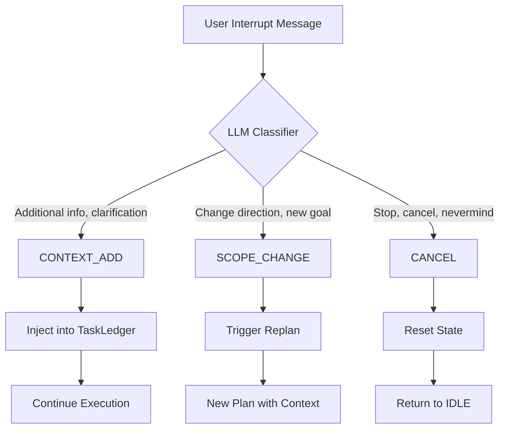
```mermaid
flowchart TD
    A[User Interrupt Message] --> B{LLM Classifier}

    B -->|"Additional info, clarification"| C[CONTEXT_ADD]
    B -->|"Change direction, new goal"| D[SCOPE_CHANGE]
    B -->|"Stop, cancel, nevermind"| E[CANCEL]

    C --> F[Inject into TaskLedger]
    F --> G[Continue Execution]

    D --> H[Trigger Replan]
    H --> I[New Plan with Context]

    E --> J[Reset State]
    J --> K[Return to IDLE]
```

---

## 3. Complete Message Flow

End-to-end flow from frontend to backend and back.

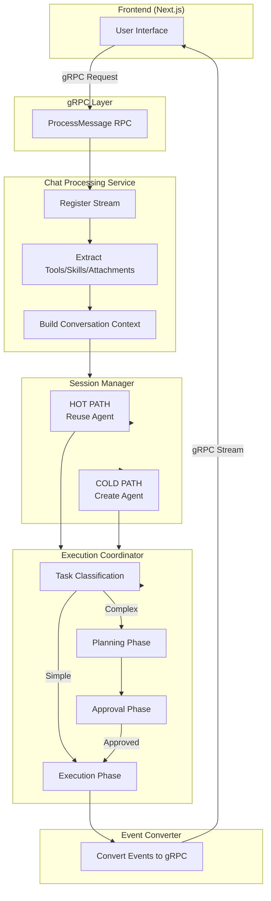
```mermaid
flowchart TB
    subgraph Frontend["Frontend (Next.js)"]
        UI[User Interface]
    end

    subgraph gRPC["gRPC Layer"]
        PM[ProcessMessage RPC]
    end

    subgraph CPS["Chat Processing Service"]
        REG[Register Stream]
        EXT[Extract Tools/Skills/Attachments]
        BUILD[Build Conversation Context]
    end

    subgraph SM["Session Manager"]
        HOT[HOT PATH<br/>Reuse Agent]
        COLD[COLD PATH<br/>Create Agent]
    end

    subgraph EC["Execution Coordinator"]
        CLASS[Task Classification]
        PLAN[Planning Phase]
        APPROVE[Approval Phase]
        EXEC[Execution Phase]
    end

    subgraph CONV["Event Converter"]
        CONVERT[Convert Events to gRPC]
    end

    UI -->|"gRPC Request"| PM
    PM --> REG --> EXT --> BUILD
    BUILD --> SM

    SM --> HOT
    SM --> COLD
    HOT --> EC
    COLD --> EC

    EC --> CLASS
    CLASS -->|"Simple"| EXEC
    CLASS -->|"Complex"| PLAN
    PLAN --> APPROVE
    APPROVE -->|"Approved"| EXEC

    EXEC --> CONVERT
    CONVERT -->|"gRPC Stream"| UI
```

### Detailed Execution Flow

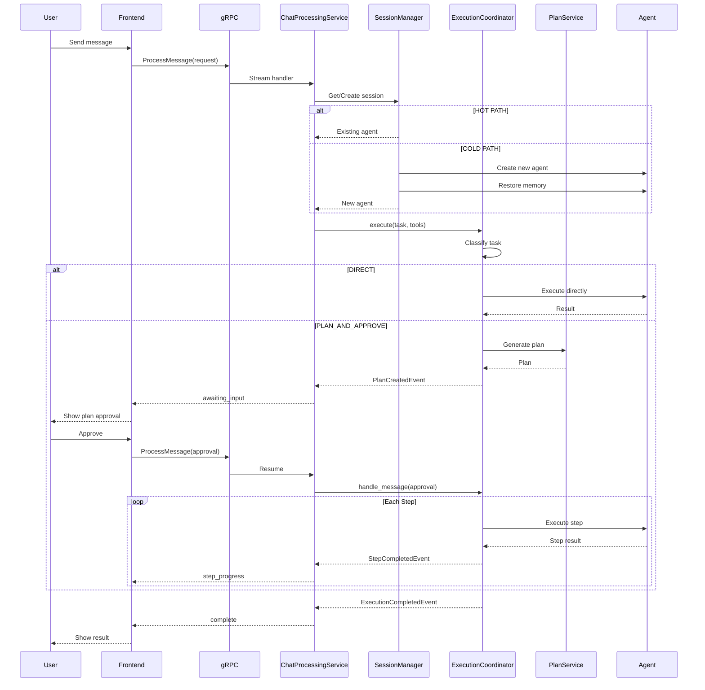
```mermaid
sequenceDiagram
    participant U as User
    participant F as Frontend
    participant G as gRPC
    participant C as ChatProcessingService
    participant S as SessionManager
    participant E as ExecutionCoordinator
    participant P as PlanService
    participant A as Agent

    U->>F: Send message
    F->>G: ProcessMessage(request)
    G->>C: Stream handler

    C->>S: Get/Create session
    alt HOT PATH
        S-->>C: Existing agent
    else COLD PATH
        S->>A: Create new agent
        S->>A: Restore memory
        S-->>C: New agent
    end

    C->>E: execute(task, tools)
    E->>E: Classify task

    alt DIRECT
        E->>A: Execute directly
        A-->>E: Result
    else PLAN_AND_APPROVE
        E->>P: Generate plan
        P-->>E: Plan
        E-->>C: PlanCreatedEvent
        C-->>F: awaiting_input
        F-->>U: Show plan approval
        U->>F: Approve
        F->>G: ProcessMessage(approval)
        G->>C: Resume
        C->>E: handle_message(approval)

        loop Each Step
            E->>A: Execute step
            A-->>E: Step result
            E-->>C: StepCompletedEvent
            C-->>F: step_progress
        end
    end

    E-->>C: ExecutionCompletedEvent
    C-->>F: complete
    F-->>U: Show result
```

---

## 4. @agent Mention Routing

User-defined agents can be invoked directly via `@agent:name` mentions, bypassing normal orchestration.

### Overview

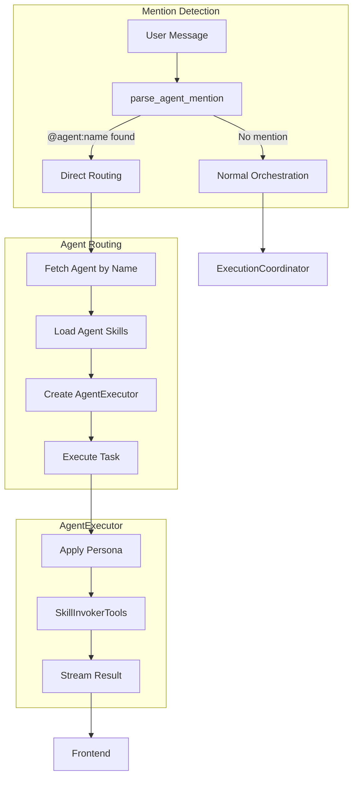
```mermaid
flowchart TB
    subgraph Detection["Mention Detection"]
        MSG[User Message] --> PARSE[parse_agent_mention]
        PARSE -->|"@agent:name found"| ROUTE[Direct Routing]
        PARSE -->|"No mention"| NORMAL[Normal Orchestration]
    end

    subgraph Routing["Agent Routing"]
        ROUTE --> FETCH[Fetch Agent by Name]
        FETCH --> SKILLS[Load Agent Skills]
        SKILLS --> CREATE[Create AgentExecutor]
        CREATE --> RUN[Execute Task]
    end

    subgraph Execution["AgentExecutor"]
        RUN --> PERSONA[Apply Persona]
        PERSONA --> TOOLS[SkillInvokerTools]
        TOOLS --> RESULT[Stream Result]
    end

    RESULT --> UI[Frontend]
    NORMAL --> EC[ExecutionCoordinator]
```

### Mention Detection Flow

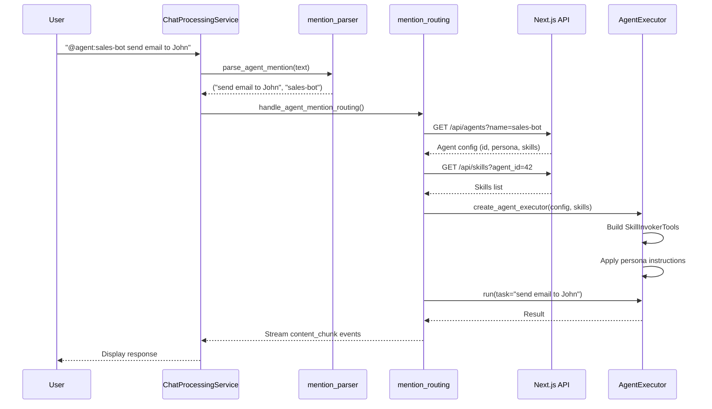
```mermaid
sequenceDiagram
    participant U as User
    participant CPS as ChatProcessingService
    participant MP as mention_parser
    participant MR as mention_routing
    participant API as Next.js API
    participant AE as AgentExecutor

    U->>CPS: "@agent:sales-bot send email to John"
    CPS->>MP: parse_agent_mention(text)
    MP-->>CPS: ("send email to John", "sales-bot")

    CPS->>MR: handle_agent_mention_routing()
    MR->>API: GET /api/agents?name=sales-bot
    API-->>MR: Agent config (id, persona, skills)
    MR->>API: GET /api/skills?agent_id=42
    API-->>MR: Skills list

    MR->>AE: create_agent_executor(config, skills)
    AE->>AE: Build SkillInvokerTools
    AE->>AE: Apply persona instructions

    MR->>AE: run(task="send email to John")
    AE-->>MR: Result
    MR-->>CPS: Stream content_chunk events
    CPS-->>U: Display response
```

### AgentExecutor Architecture

The AgentExecutor creates a dynamic `ToolCallingAgent` at runtime:

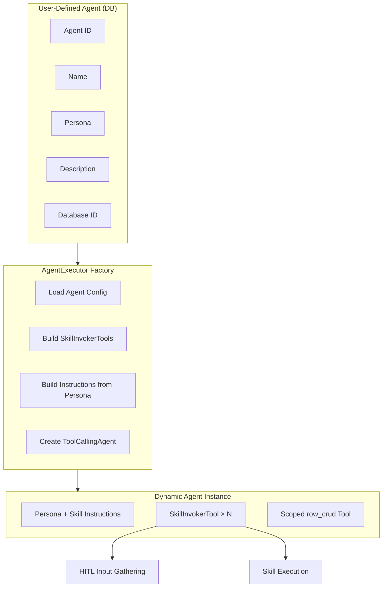
```mermaid
flowchart TB
    subgraph UserAgent["User-Defined Agent (DB)"]
        UA_ID[Agent ID]
        UA_NAME[Name]
        UA_PERSONA[Persona]
        UA_DESC[Description]
        UA_DB[Database ID]
    end

    subgraph AgentExecutor["AgentExecutor Factory"]
        LOAD[Load Agent Config]
        BUILD_TOOLS[Build SkillInvokerTools]
        BUILD_PROMPT[Build Instructions from Persona]
        CREATE_TCA[Create ToolCallingAgent]
    end

    subgraph DynamicAgent["Dynamic Agent Instance"]
        INSTRUCTIONS[Persona + Skill Instructions]
        SKILL_TOOLS[SkillInvokerTool × N]
        ROW_CRUD[Scoped row_crud Tool]
    end

    UserAgent --> AgentExecutor
    AgentExecutor --> DynamicAgent

    SKILL_TOOLS --> HITL[HITL Input Gathering]
    SKILL_TOOLS --> EXEC[Skill Execution]
```

### SkillInvokerTool Pattern

Each agent skill becomes a callable tool:

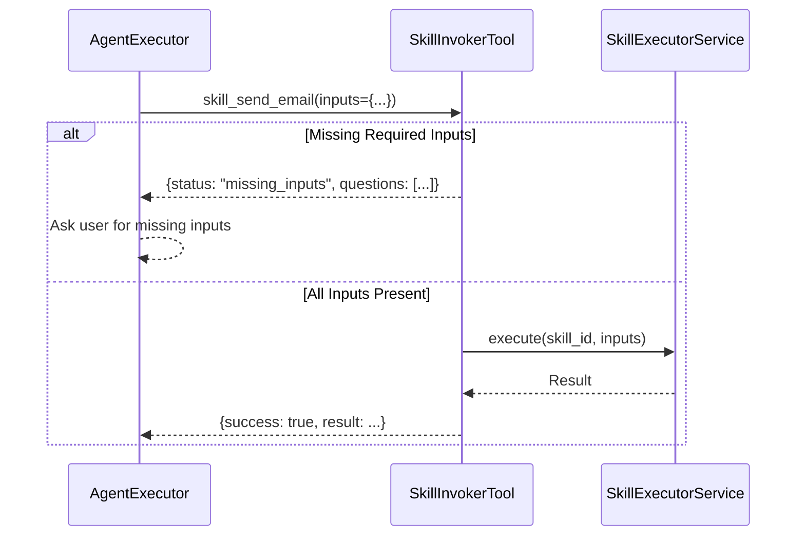
```mermaid
sequenceDiagram
    participant A as AgentExecutor
    participant SIT as SkillInvokerTool
    participant SE as SkillExecutorService

    A->>SIT: skill_send_email(inputs={...})

    alt Missing Required Inputs
        SIT-->>A: {status: "missing_inputs", questions: [...]}
        A-->>A: Ask user for missing inputs
    else All Inputs Present
        SIT->>SE: execute(skill_id, inputs)
        SE-->>SIT: Result
        SIT-->>A: {success: true, result: ...}
    end
```

### Key Components

| Component | Purpose |
|-----------|---------|
| `mention_parser.py` | Parse @agent:name from message text |
| `mention_routing.py` | Handle routing to user-defined agents |
| `agent_executor_agent.py` | Create dynamic ToolCallingAgent |
| `skill_invoker_tool.py` | Wrap skills as callable tools |
| `agent_executor.j2` | Persona-based prompt template |

### API Endpoints Used

| Endpoint | Purpose |
|----------|---------|
| `GET /api/agents?name=X` | Look up agent by name |
| `GET /api/agents?format=llm` | List agents in TOON format |
| `GET /api/skills?agent_id=X` | Get skills for agent |
| `GET /api/skills?format=llm` | List skills in TOON format |

---

## 5. Event Types

### Event Hierarchy

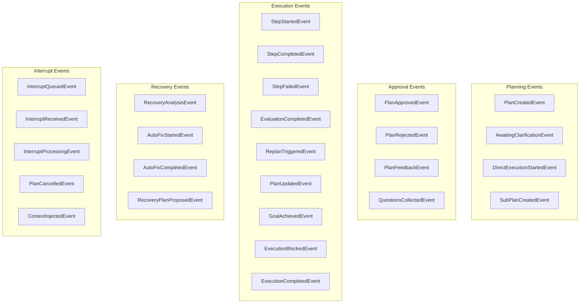
```mermaid
flowchart TB
    subgraph Planning["Planning Events"]
        PC[PlanCreatedEvent]
        AC[AwaitingClarificationEvent]
        DE[DirectExecutionStartedEvent]
        SP[SubPlanCreatedEvent]
    end

    subgraph Approval["Approval Events"]
        PA[PlanApprovedEvent]
        PR[PlanRejectedEvent]
        PF[PlanFeedbackEvent]
        QC[QuestionsCollectedEvent]
    end

    subgraph Execution["Execution Events"]
        SS[StepStartedEvent]
        SC[StepCompletedEvent]
        SF[StepFailedEvent]
        EC2[EvaluationCompletedEvent]
        RT[ReplanTriggeredEvent]
        PU[PlanUpdatedEvent]
        GA[GoalAchievedEvent]
        EB[ExecutionBlockedEvent]
        EComp[ExecutionCompletedEvent]
    end

    subgraph Recovery["Recovery Events"]
        RA[RecoveryAnalysisEvent]
        AFS[AutoFixStartedEvent]
        AFC[AutoFixCompletedEvent]
        RPP[RecoveryPlanProposedEvent]
    end

    subgraph Interrupt["Interrupt Events"]
        IQ[InterruptQueuedEvent]
        IR[InterruptReceivedEvent]
        IP[InterruptProcessingEvent]
        PCan[PlanCancelledEvent]
        CI[ContextInjectedEvent]
    end
```

### Event to gRPC Response Mapping

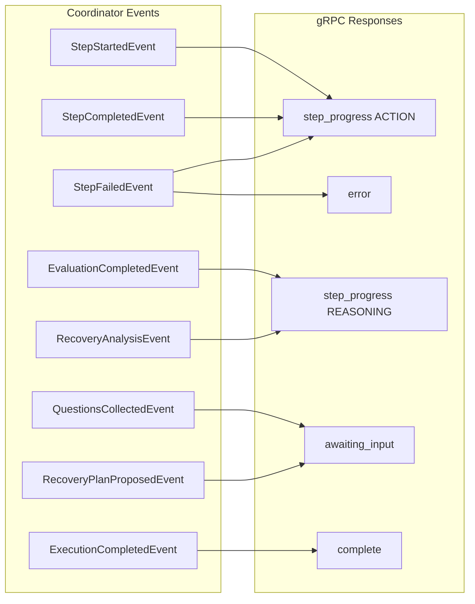
```mermaid
flowchart LR
    subgraph Events["Coordinator Events"]
        E1[StepStartedEvent]
        E2[StepCompletedEvent]
        E3[StepFailedEvent]
        E4[EvaluationCompletedEvent]
        E5[RecoveryAnalysisEvent]
        E6[QuestionsCollectedEvent]
        E7[RecoveryPlanProposedEvent]
        E8[ExecutionCompletedEvent]
    end

    subgraph Responses["gRPC Responses"]
        R1[step_progress ACTION]
        R2[step_progress REASONING]
        R3[awaiting_input]
        R4[complete]
        R5[error]
    end

    E1 --> R1
    E2 --> R1
    E3 --> R1
    E3 --> R5
    E4 --> R2
    E5 --> R2
    E6 --> R3
    E7 --> R3
    E8 --> R4
```

---

## 6. Callback Patterns

### Step Callbacks (smolagents)

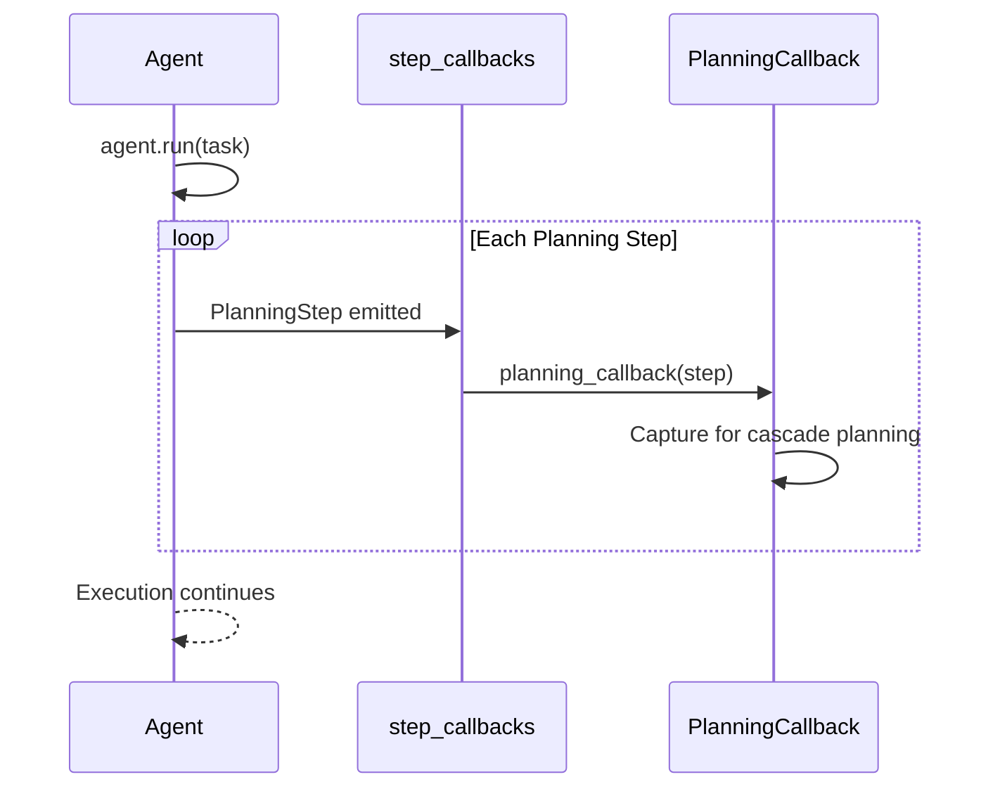
```mermaid
sequenceDiagram
    participant A as Agent
    participant S as step_callbacks
    participant P as PlanningCallback

    A->>A: agent.run(task)

    loop Each Planning Step
        A->>S: PlanningStep emitted
        S->>P: planning_callback(step)
        P->>P: Capture for cascade planning
    end

    A-->>A: Execution continues
```

### Progress Callbacks (Nested Skills)

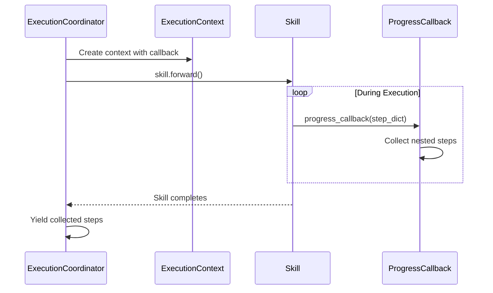
```mermaid
sequenceDiagram
    participant E as ExecutionCoordinator
    participant C as ExecutionContext
    participant S as Skill
    participant CB as ProgressCallback

    E->>C: Create context with callback
    E->>S: skill.forward()

    loop During Execution
        S->>CB: progress_callback(step_dict)
        CB->>CB: Collect nested steps
    end

    S-->>E: Skill completes
    E->>E: Yield collected steps
```

### Evaluation Tool Pattern

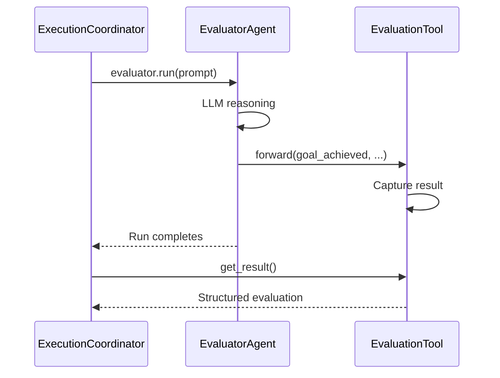
```mermaid
sequenceDiagram
    participant E as ExecutionCoordinator
    participant EA as EvaluatorAgent
    participant ET as EvaluationTool

    E->>EA: evaluator.run(prompt)
    EA->>EA: LLM reasoning
    EA->>ET: forward(goal_achieved, ...)
    ET->>ET: Capture result
    EA-->>E: Run completes
    E->>ET: get_result()
    ET-->>E: Structured evaluation
```

### HITL Interrupt Flow

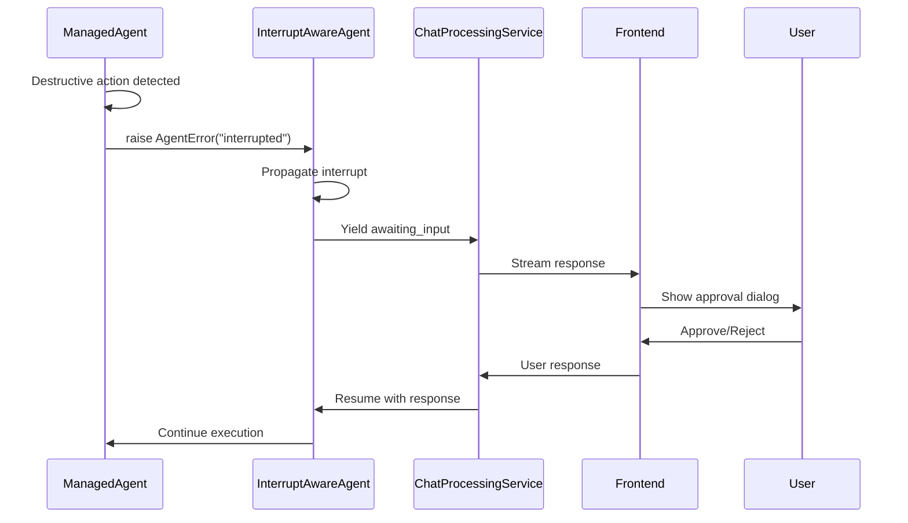
```mermaid
sequenceDiagram
    participant MA as ManagedAgent
    participant IA as InterruptAwareAgent
    participant CPS as ChatProcessingService
    participant F as Frontend
    participant U as User

    MA->>MA: Destructive action detected
    MA->>IA: raise AgentError("interrupted")
    IA->>IA: Propagate interrupt
    IA->>CPS: Yield awaiting_input
    CPS->>F: Stream response
    F->>U: Show approval dialog
    U->>F: Approve/Reject
    F->>CPS: User response
    CPS->>IA: Resume with response
    IA->>MA: Continue execution
```

---

## 7. Error Recovery Flow

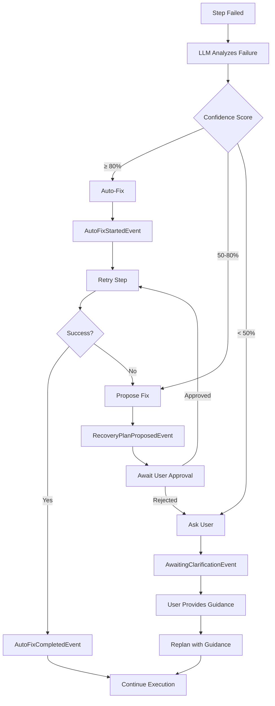
```mermaid
flowchart TB
    FAIL[Step Failed] --> ANALYZE[LLM Analyzes Failure]
    ANALYZE --> CONF{Confidence Score}

    CONF -->|"≥ 80%"| AUTO[Auto-Fix]
    CONF -->|"50-80%"| PROPOSE[Propose Fix]
    CONF -->|"< 50%"| ASK[Ask User]

    AUTO --> AFS[AutoFixStartedEvent]
    AFS --> RETRY[Retry Step]
    RETRY --> SUCCESS{Success?}
    SUCCESS -->|Yes| AFC[AutoFixCompletedEvent]
    SUCCESS -->|No| PROPOSE

    PROPOSE --> RPP[RecoveryPlanProposedEvent]
    RPP --> AWAIT[Await User Approval]
    AWAIT -->|Approved| RETRY
    AWAIT -->|Rejected| ASK

    ASK --> AC[AwaitingClarificationEvent]
    AC --> USER[User Provides Guidance]
    USER --> REPLAN[Replan with Guidance]

    AFC --> CONTINUE[Continue Execution]
    REPLAN --> CONTINUE
```

### Error Classification

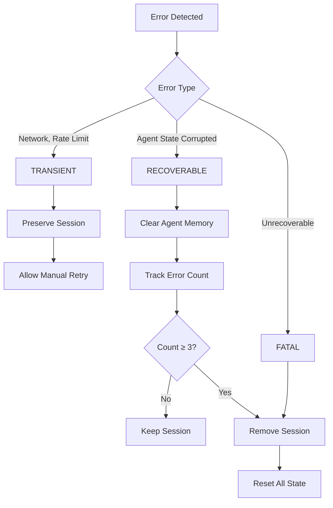
```mermaid
flowchart TD
    ERROR[Error Detected] --> CLASSIFY{Error Type}

    CLASSIFY -->|"Network, Rate Limit"| TRANSIENT[TRANSIENT]
    CLASSIFY -->|"Agent State Corrupted"| RECOVERABLE[RECOVERABLE]
    CLASSIFY -->|"Unrecoverable"| FATAL[FATAL]

    TRANSIENT --> PRESERVE[Preserve Session]
    PRESERVE --> MANUAL[Allow Manual Retry]

    RECOVERABLE --> CLEAR[Clear Agent Memory]
    CLEAR --> TRACK[Track Error Count]
    TRACK --> CHECK{Count ≥ 3?}
    CHECK -->|No| KEEP[Keep Session]
    CHECK -->|Yes| REMOVE[Remove Session]

    FATAL --> REMOVE
    REMOVE --> RESET[Reset All State]
```

---

## 8. Key Files Reference

### Core Orchestration

| File | Purpose |
|------|---------|
| `execution_coordinator.py` | Main state machine, phases, event emission |
| `chat_processing_service.py` | gRPC entry point, streaming, session routing |
| `session_manager.py` | Agent lifecycle, memory persistence |
| `coordinator_event_converter.py` | Event → gRPC response conversion |
| `response_types.py` | TypedDict definitions for responses, factory functions |
| `interrupt_classifier.py` | LLM-based interrupt classification |
| `task_classifier.py` | Task complexity classification |
| `plan_service.py` | Plan generation and recovery analysis |
| `step_executor.py` | Individual step execution |
| `task_ledger.py` | Execution state tracking |

### User-Defined Agent Execution

| File | Purpose |
|------|---------|
| `mention_parser.py` | Parse @agent:name mentions from messages |
| `mention_routing.py` | Route to user-defined agents via async API calls |
| `agent_executor_agent.py` | Dynamic ToolCallingAgent factory for user agents |
| `skill_invoker_tool.py` | Wrap skills as callable tools with HITL input gathering |
| `agent_executor.j2` | Persona-based prompt template for user agents |

### Built-in Agents

| File | Purpose |
|------|---------|
| `evaluator_agent.py` | Goal/progress evaluation agent |
| `skill_builder_agent.py` | HITL agent for skill modifications |
| `document_builder_agent.py` | HITL agent for document operations |
| `table_builder_agent.py` | HITL agent for table modifications |
| `schema_builder_agent.py` | HITL agent for complex schema design |
| `research_agent.py` | Web search and research agent |
| `research_emery_agent.py` | System introspection agent |

---

## Architecture Summary

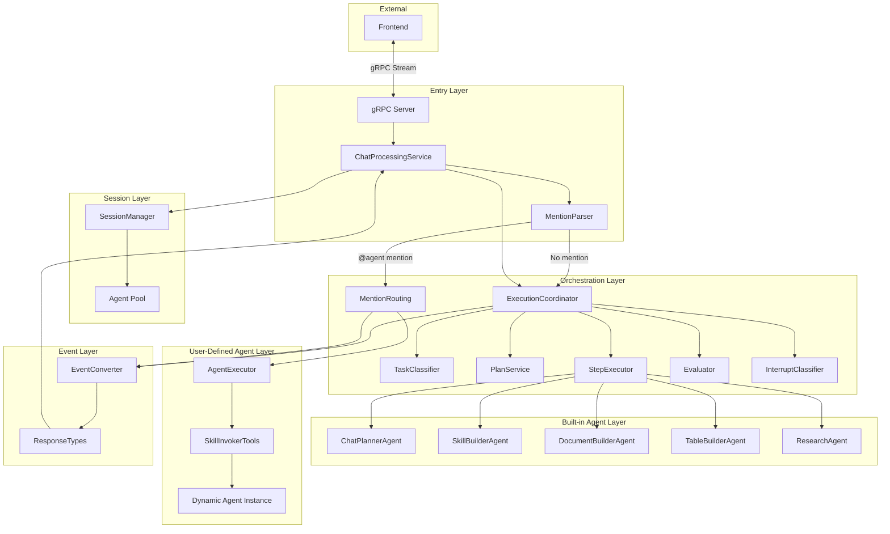
```mermaid
flowchart TB
    subgraph External["External"]
        FE[Frontend]
    end

    subgraph Entry["Entry Layer"]
        GRPC[gRPC Server]
        CPS[ChatProcessingService]
        MP[MentionParser]
    end

    subgraph Session["Session Layer"]
        SM[SessionManager]
        AGENTS[Agent Pool]
    end

    subgraph Orchestration["Orchestration Layer"]
        EC[ExecutionCoordinator]
        TC[TaskClassifier]
        PS[PlanService]
        SE[StepExecutor]
        EV[Evaluator]
        IC[InterruptClassifier]
        MR[MentionRouting]
    end

    subgraph Agents["Built-in Agent Layer"]
        CA[ChatPlannerAgent]
        SB[SkillBuilderAgent]
        DB[DocumentBuilderAgent]
        TB[TableBuilderAgent]
        RA[ResearchAgent]
    end

    subgraph UserAgents["User-Defined Agent Layer"]
        AE[AgentExecutor]
        SIT[SkillInvokerTools]
        UA[Dynamic Agent Instance]
    end

    subgraph Events["Event Layer"]
        CONV[EventConverter]
        RESP[ResponseTypes]
    end

    FE <-->|gRPC Stream| GRPC
    GRPC --> CPS
    CPS --> MP
    MP -->|"@agent mention"| MR
    MP -->|"No mention"| EC
    MR --> AE
    AE --> SIT
    SIT --> UA
    CPS --> SM
    SM --> AGENTS
    CPS --> EC
    EC --> TC
    EC --> PS
    EC --> SE
    EC --> EV
    EC --> IC
    SE --> CA
    SE --> SB
    SE --> DB
    SE --> TB
    SE --> RA
    EC --> CONV
    MR --> CONV
    CONV --> RESP
    RESP --> CPS
```

### Routing Decision Flow

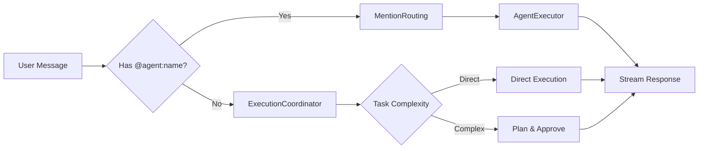
```mermaid
flowchart LR
    MSG[User Message] --> CHECK{Has @agent:name?}
    CHECK -->|Yes| MR[MentionRouting]
    CHECK -->|No| EC[ExecutionCoordinator]

    MR --> AE[AgentExecutor]
    AE --> STREAM[Stream Response]

    EC --> TC{Task Complexity}
    TC -->|Direct| EXEC[Direct Execution]
    TC -->|Complex| PLAN[Plan & Approve]
    EXEC --> STREAM
    PLAN --> STREAM
```
